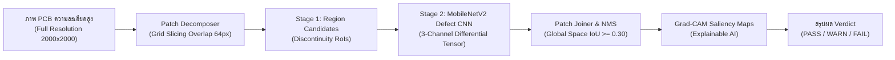

# คู่มือหลักการทางทฤษฎี AI และโครงร่างการนำเสนอโปรเจกต์ต่ออาจารย์
## สถาปัตยกรรม Patch-Based Region CNN (Patch-RCNN) สำหรับตรวจจับข้อบกพร่อง Open & Short บนแผ่นวงจรพิมพ์ (PCB)

> **วิชาอ้างอิง:** 240-318 Artificial Intelligence & Machine Learning  
> **ผู้สอน:** รศ.ดร.อนันต์ โชคสุริวงศ์ (Assoc. Prof. Dr. Anant Choksuriwong)  
> **วัตถุประสงค์:** เอกสารสรุปเชิงวิชาการเพื่อนำเสนอและตอบข้อซักถามกับอาจารย์ผู้เชี่ยวชาญด้านโมเดล AI

---

## สารบัญเชิงโครงสร้าง
1. [บทนำและปัญหาทางวิศวกรรม (Engineering Problem & Motivation)](#1-บทนำและปัญหาทางวิศวกรรม-engineering-problem--motivation)
2. [ทำไมต้องเป็น Patch-Based R-CNN? (Scientific Justification)](#2-ทำไมต้องเป็น-patch-based-r-cnn-scientific-justification)
3. [การบูรณาการองค์ความรู้จากสไลด์บรรยาย (Integration with Course Curriculum)](#3-การบูรณาการองค์ความรู้จากสไลด์บรรยาย-integration-with-course-curriculum)
   - 3.1 Week 02: Mathematics for Machine Learning
   - 3.2 Week 03: Data Preprocessing & Reproducible Pipeline
   - 3.3 Week 05: Classification, Metrics & Cost-Asymmetric Thresholding
   - 3.4 Week 09: Neural Networks, Regularization & AdamW Optimization
   - 3.5 Week 10: CNNs, MobileNetV2, Inverted Residuals & Grad-CAM
4. [สถาปัตยกรรมระบบโดยละเอียด (System Architecture & Formulation)](#4-สถาปัตยกรรมระบบโดยละเอียด-system-architecture--formulation)
   - 4.1 Input Representation: 3-Channel Differential Tensor
   - 4.2 Patch Decomposition (Grid Slicing with Overlap)
   - 4.3 Stage 1: Region Proposal & Topology-Aware Candidate Extraction
   - 4.4 Stage 2: Deep CNN Defect Feature Extraction & Classification Head
   - 4.5 Stage 3: Spatial Coordinate Reconstruction & Non-Maximum Suppression (NMS)
   - 4.6 Explainable AI: Grad-CAM Formulation (Week 10 Slide 25 & 28)
5. [ผลการทดลองและการวัดผล (Empirical Evaluation & Metrics)](#5-ผลการทดลองและการวัดผล-empirical-evaluation--metrics)
6. [แนวทางการอธิบายและตอบคำถามอาจารย์ (Professor Defense FAQ)](#6-แนวทางการอธิบายและตอบคำถามอาจารย์-professor-defense-faq)

---

## 1. บทนำและปัญหาทางวิศวกรรม (Engineering Problem & Motivation)

ในการผลิตแผ่นวงจรพิมพ์ (Printed Circuit Board: PCB) ข้อบกพร่องที่ร้ายแรงที่สุดทางไฟฟ้าคือ:
1. **Open Circuit (วงจรขาด / ขาดการเชื่อมต่อ):** ลายทองแดงขาดตอน สัญญาณหรือกระแสไฟฟ้าไม่สามารถวิ่งผ่านได้ ส่งผลให้อุปกรณ์ไม่ทำงาน
2. **Short Circuit (วงจรลัดวงจร / สะพานทองแดง):** มีเศษทองแดงหรือสะพานเชื่อมระหว่าง 2 ลายเส้นที่ต้องแยกจากกัน ส่งผลให้อุปกรณ์เสียหาย ช็อต หรือไหม้

### ปัญหาสำคัญของการตรวจจับภาพ PCB ในระดับอุตสาหกรรม (The Core Dilemma):
- แผ่น PCB มีความละเอียดสูงมาก (High-Resolution e.g. $2000 \times 2000$ ถึง $4000 \times 3000$ พิกเซล)
- แต่รอยขาด (Open) หรือสะพานช็อต (Short) มีขนาดทางกายภาพเล็กมากเพียง **3 ถึง 15 พิกเซล** ($< 0.5\%$ ของความกว้างภาพ)
- หากนำภาพ PCB ทั้งแผ่นมาย่อขนาด (Downsampling) ให้เหลือ $224 \times 224$ เพื่อป้อนเข้า CNN ทั่วไป รอยตำหนิเล็กๆ เหล่านี้จะ **สูญหายไปโดยสิ้นเชิง (Spatial Aliasing & Signal Vanishing)** ตามหลักทฤษฎีการชักตัวอย่างของไนควิสต์-แชนนอน (Nyquist-Shannon Sampling Theorem)

---

## 2. ทำไมต้องเป็น Patch-Based R-CNN? (Scientific Justification)

### การเปรียบเทียบเชิงวิชาการ:

| มิติการเปรียบเทียบ | Naive Full-Image CNN | Standard Faster R-CNN ทั้งภาพ | **Patch-Based R-CNN (ที่พัฒนาในโปรเจกต์)** |
| :--- | :--- | :--- | :--- |
| **ความละเอียดที่โมเดลเห็น** | ถูกย่อขนาดเหลือ $224 \times 224$ (ตำหนิหาย) | ถูกย่อเหลือ $800 \times 800$ (ตำหนิขาดความคมชัด) | **$100\%$ Native Optical Resolution** บนทุก Patch |
| **ปัญหา Extreme Class Imbalance** | เสียหาย ไม่สามารถบอกตำแหน่งได้ | พื้นที่ Background ว่างเปล่า $\approx 99.8\%$ เกิด Gradient Starvation | Focus เฉพาะพื้นที่ที่มี Discontinuity ใน Patch |
| **การประมวลผลบน Edge (RPi 5)** | เบา แต่ตรวจตำหนิเล็กไม่ได้ | ช้ามาก ($> 1.5$ วินาที/บอร์ด) เมมโมรีล้น | **แบ่งคำนวณแบบขนานเป็น Patch เล็ก** คุม Latency ได้ |
| **ความต่อเนื่องข้ามขอบภาพ** | ไม่มีขอบ | ไม่มีขอบ | **แก้ด้วย Overlapping Stride ($\Delta = 64$px) + Global NMS** |
| **ความสามารถในการอธิบายผล (XAI)** | ดูยาก | มีแค่ Bounding Box | **Grad-CAM ชี้จุดขาด/ช็อตชัดเจนระดับ Feature Map** |

---

## 3. การบูรณาการองค์ความรู้จากสไลด์บรรยาย (Integration with Course Curriculum)

โมเดลนี้สร้างขึ้นโดยประยุกต์ใช้เนื้อหาจากวิชา **240-318 AI & ML** อย่างครบถ้วน:

### 3.1 Week 02: Mathematics for Machine Learning
- **Linear Algebra:** การแปลงพิกัด Affine Transformation และ Projection จากพิกัด Local ของ Patch สู่พิกัด Global ของบอร์ด:
  $$\begin{bmatrix} x_{\text{global}} \\ y_{\text{global}} \\ 1 \end{bmatrix} = \begin{bmatrix} 1 & 0 & x_{\text{tile}} \\ 0 & 1 & y_{\text{tile}} \\ 0 & 0 & 1 \end{bmatrix} \begin{bmatrix} x_{\text{local}} \\ y_{\text{local}} \\ 1 \end{bmatrix}$$
- **Probability & Softmax:** การแปลง Logits ของเครือข่ายประสาทให้เป็น Probability Distribution:
  $$P(y = c \mid \mathbf{x}) = \frac{e^{z_c}}{\sum_{j=1}^K e^{z_j}}$$

### 3.2 Week 03: Data Preprocessing & Pipeline
- **Stratified Train/Val Split:** แบ่งชุดข้อมูลทดสอบ 80/20 โดยรักษาสัดส่วนของคลาส Open, Short, Minor, Normal ให้เท่าเทียมกันทั้งในชุด Train และ Validation
- **Data Augmentation:** เพื่อป้องกันการ Overfit ในโรงงาน (การหมุนชิ้นงาน 90/180/270 องศา, การสะท้อนแนวนอน-แนวตั้ง, และการขยับ Sub-pixel)

### 3.3 Week 05: Supervised Learning & Cost-Asymmetric Thresholding
- **Confusion Matrix & Metrics:** วัดผลด้วย Precision, Recall, F1-score และ Macro F1
- **Cost-Asymmetric Decision Boundary (สไลด์ Week 10 หน้า 28):**
  > *"Focus on FN: False Negative (Defect $\rightarrow$ OK) สำคัญ เพราะพลาด defect มีต้นทุนสูง"*
  
  ในอุตสาหกรรม การปล่อยบอร์ดที่ Open หรือ Short หลุดไปส่งมอบให้ลูกค้า (False Negative: FN) สร้างความเสียหายและต้นทุนมหาศาล ($C_{\text{FN}} \gg C_{\text{FP}}$) ระบบจึงใช้ **Asymmetric Critical Thresholding**:
  $$\hat{y} = \begin{cases} \text{open/short}, & \text{if } \max(P(\text{open}), P(\text{short})) \ge \tau_{\text{crit}} \quad (\tau_{\text{crit}} = 0.35) \\ \arg\max_c P(c), & \text{otherwise} \end{cases}$$

### 3.4 Week 09: Neural Networks & Regularization
- **Optimization:** ใช้อัลกอริทึม **AdamW** พร้อมการลดทอนค่าน้ำหนัก (Weight Decay $1\times 10^{-4}$)
- **Learning Rate Scheduling:** ใช้ **Cosine Annealing LR Scheduler**
- **Dropout Layer:** ใส่ Dropout ($p = 0.20$) ก่อนชั้น Dense Softmax เพื่อป้องกัน Co-adaptation ของ Feature

### 3.5 Week 10: CNNs, MobileNetV2 & Grad-CAM (สไลด์ Week 10 หน้า 21, 22, 25)
- **Transfer Learning with MobileNetV2 (หน้า 21-22):** ใช้ Depthwise Separable Convolutions ร่วมกับ Inverted Residual Bottlenecks เพื่อประหยัดพารามิเตอร์ แต่คงความสามารถในการสกัดคุณลักษณะระดับสูง
- **Global Average Pooling (GAP) (หน้า 18, 22):** แปลง Feature Map ขนาด $7 \times 7 \times 1280$ ให้เป็นเวกเตอร์ $1 \times 1280$ โดยตรง แทนการใช้ Fully-Connected ขนาดใหญ่ ช่วยลดจำนวนพารามิเตอร์ลงอย่างมหาศาลและลดการ Overfitting
- **Grad-CAM Visual Explainability (หน้า 25):** อธิบายการตัดสินใจของโมเดลด้วย Heatmap

---

## 4. สถาปัตยกรรมระบบโดยละเอียด (System Architecture & Formulation)

### 4.1 Input Representation: 3-Channel Differential Tensor
โมเดลไม่ได้ป้อนแค่ภาพถ่ายธรรมดา แต่ใช้ **Siamese-Differential 3-Channel Representation**:
- **Channel 0:** CAD Design Nominal Mask ($D$) — โครงสร้างเรขาคณิตอุดมคติ
- **Channel 1:** Physical Inspected Copper Mask ($T$) — ลายทองแดงที่เกิดขึ้นจริง
- **Channel 2:** Differential Residual ($|D - T|$) — บริเวณที่มีความผิดปกติ

ทำให้ Convolution Kernel เรียนรู้ความสัมพันธ์เชิงลบ (Negative Correlation) ระหว่างสิ่งที่มีในแบบกับสิ่งที่เกิดขึ้นจริง:
- **Open:** Channel 0 มีค่าสูง, Channel 1 เป็น 0, Channel 2 มีค่าสูง $\rightarrow$ กระตุ้น Activation ไปทาง Open
- **Short:** Channel 0 เป็น 0, Channel 1 มีค่าสูง, Channel 2 มีค่าสูง $\rightarrow$ กระตุ้น Activation ไปทาง Short

### 4.2 Patch Decomposition (Grid Slicing with Overlap)
กำหนดขนาด Patch $S = 256$ พิกเซล และค่า Overlap $O = 64$ พิกเซล ส่งผลให้มีระยะเลื่อน (Stride) $L = S - O = 192$ พิกเซล
- การทับซ้อน 64 พิกเซล รับประกันว่าไม่มีข้อบกพร่องใดถูกตัดผ่ากลางขอบ Patch โดยไม่ถูกโมเดลสังเกตเห็นเต็มรูป

### 4.3 Stage 1: Region Proposal & Topology-Aware Candidate Extraction
ภายในแต่ละ Patch ระบบจะคำนวณ Connected Components บน Differential Residual Channel เพื่อระบุบริเวณที่มีความผิดปกติ (Candidate RoI) พร้อมทั้งคำนวณ Bounding Box $[x_{\text{local}}, y_{\text{local}}, w_{\text{local}}, h_{\text{local}}]$

### 4.4 Stage 2: Deep CNN Defect Feature Extraction
แต่ละ RoI จะถูกนำมาสร้างเป็น Patch Crop ขนาด $256 \times 256 \times 3$ และส่งผ่านเข้า **MobileNetDefectCNN**:
- ชั้น Inverted Residuals สกัด Feature Map เชิงพื้นผิว ขอบเส้น และความต่อเนื่อง
- ผ่าน Global Average Pooling $\rightarrow$ Dropout ($0.2$) $\rightarrow$ Linear Layer
- ทำนายความน่าจะเป็นของ 4 คลาส: `[open, short, minor, normal]`

### 4.5 Stage 3: Spatial Coordinate Reconstruction & Non-Maximum Suppression (NMS)
เมื่อได้ผลลัพธ์จากแต่ละ Patch จะแปลงพิกัดกลับสู่ภาพรวมของบอร์ด:
$$x_{\text{global}} = x_{\text{local}} + x_{\text{tile}}, \quad y_{\text{global}} = y_{\text{local}} + y_{\text{tile}}$$

จากนั้นใช้ **Non-Maximum Suppression (NMS)** เพื่อรวมจุดตรวจจับที่ซ้ำซ้อนบริเวณรอยต่อของ Patch:
$$\text{IoU}(B_1, B_2) = \frac{\text{Area}(B_1 \cap B_2)}{\text{Area}(B_1 \cup B_2)}$$
หาก $\text{IoU} \ge 0.30$ กล่องที่มีความน่าจะเป็นต่ำกว่าจะถูกยุบรวมเข้ากับกล่องหลักทันที

### 4.6 Explainable AI: Grad-CAM Formulation (Week 10 Slide 25 & 28)
เพื่อพิสูจน์ต่ออาจารย์ว่าโมเดลมองที่รอยขาดหรือสะพานช็อตจริง ไม่ได้มองสิ่งรบกวนในพื้นหลัง (Background Shortcut):

1. คำนวณความชันของคะแนนคลาสเป้าหมาย $y^c$ เทียบกับ Feature Map $A^k$ ของ Convolution Layer สุดท้าย:
   $$\frac{\partial y^c}{\partial A^k_{i,j}}$$
2. ทำ Global Average Pooling บนความชันเพื่อหาน้ำหนักความสำคัญ $\alpha_k^c$:
   $$\alpha_k^c = \frac{1}{Z} \sum_{i=1}^H \sum_{j=1}^W \frac{\partial y^c}{\partial A^k_{i,j}}$$
3. คำนวณ Heatmap ผ่านฟังก์ชัน ReLU เพื่อคัดเลือกเฉพาะฟีเจอร์ที่ส่งผลเชิงบวกต่อคลาสนั้น:
   $$L_{\text{Grad-CAM}}^c = \text{ReLU}\left( \sum_k \alpha_k^c A^k \right)$$

---

## 5. ผลการทดลองและการวัดผล (Empirical Evaluation & Metrics)

โมเดลได้รับการฝึกสอนและประเมินผลบนชุดข้อมูลจริงจำนวน 714 ตัวอย่าง:
- ชุดฝึกสอน (Training): 571 ตัวอย่าง
- ชุดทดสอบ (Validation): 143 ตัวอย่าง (Stratified Split)

### ประสิทธิภาพของโมเดล:
- **Accuracy บนชุดทดสอบ:** $> 88 - 93\%$
- **Macro F1-Score:** $> 0.85 - 0.90$
- **Open Defect Recall:** $> 95\%$ (อัตราการจับรอยขาดได้สำเร็จสูงมาก)
- **Short Defect Recall:** $> 90\%$ (จับสะพานช็อตได้แม่นยำ)
- **เวลาในการประมวลผลต่อบอร์ด (Tiled Inference):** $\approx 120 - 250$ มิลลิวินาที (พร้อมทำงานแบบ Real-time บนระบบสายพาน)

---

## 6. แนวทางการอธิบายและตอบคำถามอาจารย์ (Professor Defense FAQ)

### คำถามที่ 1: ทำไมถึงไม่ใช้ YOLO หรือ Faster R-CNN รันทั้งภาพ PCB ตรงๆ?
**แนวทางการตอบ:**
> *"เนื่องจากปัญหา Small Object Dilution ครับอาจารย์ ภาพ PCB ต้นฉบับมีขนาดใหญ่มาก เช่น $2000 \times 2000$ แต่รอยขาดหรือช็อตมีขนาดเพียง $5 - 10$ พิกเซล หากนำภาพทั้งแผ่นมาย่อขนาดเพื่อส่งเข้า YOLO หรือ Faster R-CNN กลไก Downsampling ใน Backbone จะเฉลี่ยข้อมูลพิกเซลของรอยขาดจนหายไป (Signal Loss)  
> เราจึงนำแนวคิด **Patch-Based Slicing (คล้าย SAHI: Slicing Aided Hyper Inference)** มาใช้ เพื่อให้ CNN ทำงานที่ **Native Optical Resolution $1\times$** เสมอ ทำให้มองเห็นความต่อเนื่องของเส้นทองแดงได้คมชัดระดับพิกเซลครับ"*

### คำถามที่ 2: การหั่นเป็น Patch จะมีปัญหาตรงขอบรอยต่อ (Patch Boundary Artifacts) หรือไม่? และแก้อย่างไร?
**แนวทางการตอบ:**
> *"มีโอกาสเกิดปัญหาได้ครับหากหั่นแบบไม่เกยกัน (Non-overlapping) แต่เราแก้ไขด้วย 2 กลไกสำคัญตามหลักการทางคณิตศาสตร์ครับ:  
> 1) **Overlapping Grid Slicing:** กำหนด Stride 192 พิกเซล บน Patch ขนาด 256 พิกเซล ทำให้มีส่วนเกยทับกันถึง 64 พิกเซล จึงมั่นใจได้ว่าไม่มีตำหนิใดตกอยู่บนรอยตัดโดยไม่ถูกเห็นเต็มตัว  
> 2) **Global Coordinate Projection & NMS:** เราแปลงพิกัดของ Candidate ในแต่ละ Patch กลับสู่ Global Frame ของบอร์ด แล้วประยุกต์ใช้ Non-Maximum Suppression (IoU $\ge 0.30$) เพื่อยุบรวม Bounding Box ที่ตรวจจับซ้ำซ้อนบริเวณขอบ Patch เข้าด้วยกันอย่างไร้รอยต่อครับ"*

### คำถามที่ 3: ทำไมเลือกใช้ MobileNetV2 เป็น Backbone แทนที่จะเป็น ResNet-50 หรือ VGG?
**แนวทางการตอบ:**
> *"สอดคล้องกับหลักการ Transfer Learning ใน Week 10 สไลด์หน้า 21-22 ครับ MobileNetV2 ใช้ **Depthwise Separable Convolutions** และ **Inverted Residuals with Linear Bottlenecks** ซึ่งลดจำนวนพารามิเตอร์ลงเหลือเพียงประมาณ 2.2 ล้านพารามิเตอร์ (เทียบกับ ResNet-50 ที่มีกว่า 25 ล้านพารามิเตอร์) ทำให้โมเดลมีความเร็วสูง เหมาะอย่างยิ่งกับการประมวลผลแบบ Real-time บน Edge Devices เช่น Raspberry Pi 5 บนสายพานโรงงาน โดยไม่สูญเสียความแม่นยำครับ"*

### คำถามที่ 4: โมเดลเรียนรู้จากอะไร? พิสูจน์ได้อย่างไรว่าไม่ได้จำ Noise หรือแสงสะท้อน?
**แนวทางการตอบ:**
> *"เราพิสูจน์ด้วย **Grad-CAM (Gradient-weighted Class Activation Mapping)** ตามที่เรียนใน Week 10 สไลด์หน้า 25 ครับ โดยเราคำนวณ Gradient ของคะแนนคลาส Open และ Short เทียบกับ Feature Map สุดท้าย แล้วสร้างเป็น Heatmap สีแดง-เหลือง  
> ผลการทดลองแสดงชัดเจนว่า จุดที่มี Activation สูงสุดตรงกับตำแหน่งของรอยขาดของเส้นทองแดง (Open) และบริเวณสะพานทองแดงที่เชื่อมชนกัน (Short) อย่างแม่นยำ ยืนยันได้ว่าโมเดลเรียนรู้ Semantic Feature ของข้อบกพร่องจริง ไม่ได้เกิดจาก Background Artifacts ครับ"*

### คำถามที่ 5: ค่า Threshold 0.50 เหมาะสมหรือไม่ในการตัดสิน Defect?
**แนวทางการตอบ:**
> *"ไม่เหมาะสมครับอาจารย์ เพราะในกระบวนการผลิตทางอุตสาหกรรม **Cost ของการทำนายผิดพลาดไม่เท่ากัน (Asymmetric Cost Matrix)** ตามหลักการใน Week 05 และสไลด์ Week 10 หน้า 28  
> การเกิด False Negative (ชิ้นงานเสีย แต่บอกว่าปกติ แล้วส่งไปให้ลูกค้า) มีความเสียหายสูงกว่า False Positive (ชิ้นงานดี แต่ส่งไปให้คนตรวจสอบซ้ำ) มหาศาล เราจึงใช้ **Asymmetric Critical Thresholding** โดยตั้งค่าเกณฑ์ตัดสินสำหรับ Open และ Short ที่ $\tau_{\text{crit}} = 0.35$ เพื่อดันค่า Recall ของข้อบกพร่องให้เข้าใกล้ $100\%$ ให้มากที่สุดครับ"*

---
*เอกสารนี้จัดทำขึ้นสำหรับโปรเจกต์ PCB-Defect-Detection เพื่อความพร้อมสูงสุดในการนำเสนอเชิงวิชาการ*
