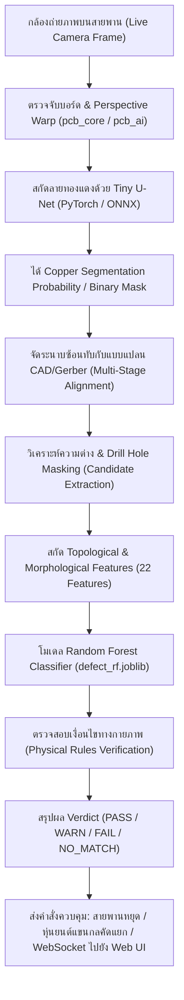

# เอกสารสรุปหลักการและอัลกอริทึม AI ทั้งหมดในระบบตรวจจับข้อบกพร่องแผ่นวงจรพิมพ์ (PCB Defect Detection System)

เอกสารฉบับนี้รวบรวมและวิเคราะห์สถาปัตยกรรมทางปัญญาประดิษฐ์ (Artificial Intelligence), คอมพิวเตอร์วิทัศน์ (Computer Vision), และขั้นตอนการคำนวณทางคณิตศาสตร์ทั้งหมดที่มีอยู่ในโครงการ **PCB-Defect-Detection** อย่างละเอียด ครบถ้วน และเจาะลึกในทุกมิติ

---

## สารบัญเชิงโครงสร้าง
1. [ภาพรวมสถาปัตยกรรมทั้งระบบ (End-to-End System Architecture)](#1-ภาพรวมสถาปัตยกรรมทั้งระบบ-end-to-end-system-architecture)
2. [กระบวนการด้านข้อมูลและการสังเคราะห์ข้อมูล (Data Acquisition, Synthesis & Preprocessing)](#2-กระบวนการด้านข้อมูลและการสังเคราะห์ข้อมูล-data-acquisition-synthesis--preprocessing)
   - 2.1 การตรวจจับและดัดภาพบอร์ด (Board Localization & Perspective Warp)
   - 2.2 การสร้าง Label และระบบ 3-Level Quantization Mask
   - 2.3 การสังเคราะห์ข้อมูลเสมือนจริง (Procedural PCB & Defect Synthesis)
   - 2.4 Data Augmentation สำหรับสภาวะสายพานอุตสาหกรรม
3. [โมเดลแยกพื้นที่ลายทองแดง: Tiny U-Net Architecture](#3-โมเดลแยกพื้นที่ลายทองแดง-tiny-u-net-architecture)
   - 3.1 สถาปัตยกรรมโครงข่ายประสาท (Network Architecture)
   - 3.2 ความคุ้มค่าทางพารามิเตอร์และ Real-time Inference บน Edge (Raspberry Pi 5)
4. [ฟังก์ชันการสูญเสียทางคณิตศาสตร์และการประเมินผล (Loss Functions & Metrics)](#4-ฟังก์ชันการสูญเสียทางคณิตศาสตร์และการประเมินผล-loss-functions--metrics)
   - 4.1 Masked Binary Cross-Entropy Loss (BCE)
   - 4.2 Masked Soft Dice Loss
   - 4.3 Centerline Dice Loss (clDice) & Differentiable Soft-Skeletonization
   - 4.4 Total Combined Loss & Curriculum Warm-up
   - 4.5 เมตริกการประเมินผลเชิงโครงสร้างและทอพอโลยี (IoU, Skel-Recall, Skel-Precision, clDice)
5. [กระบวนการฝึกสอนโมเดล (Training Pipeline & Optimization)](#5-กระบวนการฝึกสอนโมเดล-training-pipeline--optimization)
   - 5.1 Optimizer & Learning Rate Schedule (AdamW + OneCycleLR)
   - 5.2 Automatic Mixed Precision (AMP)
   - 5.3 การคัดเลือก Best Model และการส่งออกเป็น ONNX
6. [อัลกอริทึมการจัดระนาบและจับคู่แบบแปลนอัตโนมัติ (Multi-Stage Design Alignment)](#6-อัลกอริทึมการจัดระนาบและจับคู่แบบแปลนอัตโนมัติ-multi-stage-design-alignment)
   - 6.1 การประมวลผลไฟล์แบบแปลน CAD/Gerber และการตัด Board Frame
   - 6.2 การประมาณสเกลเบื้องต้นด้วย Convex Hull Area Ratio
   - 6.3 การค้นหาแบบหยาบรอบทิศทาง (Coarse Search via 2D Integral Image NCC)
   - 6.4 การจัดระนาบละเอียดระดับ Sub-pixel ด้วย ECC Affine และ Homography
   - 6.5 เทคนิคจำลองมุมมองกล้องบนแบบแปลน (Design as Seen by Camera)
   - 6.6 Zero-Shot Multi-Template Matching อัตโนมัติ
7. [การสกัดจุดต่างและคุณลักษณะเชิงทอพอโลยี 22 มิติ (Topological Feature Extraction)](#7-การสกัดจุดต่างและคุณลักษณะเชิงทอพอโลยี-22-มิติ-topological-feature-extraction)
   - 7.1 การระบุบริเวณผู้สมัครเกิดตำหนิ (Candidate Identification)
   - 7.2 รายละเอียดคณิตศาสตร์ของ Feature ทั้ง 22 มิติ
8. [โมเดลจำแนกประเภทตำหนิ (Defect Classification: Random Forest, Rule-based & Patch-RCNN)](#8-โมเดลจำแนกประเภทตำหนิ-defect-classification-random-forest--rule-based)
   - 8.1 สถาปัตยกรรม Random Forest Classifier
   - 8.2 กลไก Asymmetric Critical Thresholding
   - 8.3 การตรวจสอบความถูกต้องทางกายภาพเพื่อขจัด False Alarm (Physical Constraint Verification)
   - 8.4 สถาปัตยกรรมใหม่: Patch-Based Region CNN (Patch-RCNN with MobileNetV2 & Grad-CAM)
9. [การตัดสินผลและการคิดคะแนนความถูกต้อง (Verdict, Accuracy & Factory Automation)](#9-การตัดสินผลและการคิดคะแนนความถูกต้อง-verdict-accuracy--factory-automation)
10. [สรุปความสัมพันธ์ของไฟล์โค้ดในโปรเจกต์ (Code Mapping)](#10-สรุปความสัมพันธ์ของไฟล์โค้ดในโปรเจกต์-code-mapping)

---

## 1. ภาพรวมสถาปัตยกรรมทั้งระบบ (End-to-End System Architecture)

ระบบในโปรแกรมนี้ถูกออกแบบมาเพื่อทำงานในสายการผลิตจริงแบบ Closed-Loop โดยบูรณาการตั้งแต่ระดับฮาร์ดแวร์ (Conveyor Belt, กล้องอุตสาหกรรม, หลอดไฟ Backlit/Frontlit, หุ่นยนต์แขนกลหยิบชิ้นงาน Robot Arm) ไปจนถึง AI Deep Learning และ Machine Learning



ระบบแบ่งชั้นการประมวลผลของ AI ออกเป็น **2 เสาหลัก (Dual-AI Engine)**:
1. **Pixel-Level Semantic Segmentation AI (Tiny U-Net)**: มีหน้าที่แปลงภาพถ่ายจริงที่มีสัญญาณรบกวน แสงสะท้อน และสีแปรปรวน ให้กลายเป็นแผนผังลายเส้นทองแดง (Copper Trace Mask) ที่แม่นยำ
2. **Topological Defect Classification AI (Random Forest บนกราฟและทอพอโลยี 22 มิติ)**: มีหน้าที่ตรวจสอบความต่อเนื่องของระบบนำไฟฟ้า เปรียบเทียบกับแบบแปลน CAD ในระดับ Netlist โดยไม่หลงผิดไปกับรอยกัดขอบขรุขระ (Chemical Etch Roughness) ซึ่งมักทำให้ระบบตรวจจับแบบ XOR ทั่วไปเกิด False Alarm มหาศาล

---

## 2. กระบวนการด้านข้อมูลและการสังเคราะห์ข้อมูล (Data Acquisition, Synthesis & Preprocessing)

### 2.1 การตรวจจับและดัดภาพบอร์ด (Board Localization & Perspective Warp)
ไฟล์ที่รับผิดชอบ: `train_ai_pcb/pcb_core.py`, `pcb-detection-backend/src/function/pcb_ai.py`

ก่อนส่งภาพเข้า AI โมเดล ระบบต้องตัดฉากหลัง (สายพานลำเลียง, โต๊ะงาน) ออก และดัดมุมเอียงของแผ่นวงจรพิมพ์ให้กลายเป็นมุมมองระนาบตรง (Top-Down Orthogonal View):

1. **การคัดแยกสีเนื้อบอร์ด (Substrate Color Space Filtering)**:
   ระบบรองรับโหมดแสง 2 แบบอัตโนมัติ:
   - **Backlit (ไฟส่องทะลุใต้แผ่น)**: แผ่นบอร์ด FR4 จะปรากฏเป็นสีเหลืองอมเขียวโปร่งแสง:
     $$\text{Substrate}_{\text{backlit}} = (17 \le H \le 43) \land (S \ge 35) \land (V \ge 70) \land (G - B > 15) \land (R - B > 20)$$
   - **Frontlit (ไฟส่องตรงจากด้านบน)**: แผ่นบอร์ด FR4 จะมืดเข้ม ลายทองแดงจะสะท้อนแสงสว่าง:
     $$\text{Substrate}_{\text{frontlit}} = ((H \le 45) \lor (H \ge 165)) \land (S \ge 35) \land (V \ge 50) \land (R - B > 20)$$
2. **การรวมกลุ่มพื้นที่ด้วยสัณฐานวิทยา (Morphological Aggregation)**:
   ใช้ Kernel วงรีขนาด $5 \times 5$ ทำ Morphological Opening เพื่อลบสัญญาณรบกวน จากนั้นใช้ Kernel สี่เหลี่ยมขนาด $k \times k$ (โดย $k = \max(21, \text{round}(\min(H, W) \times 0.08)) | 1$) ทำ Morphological Closing เพื่อเชื่อมเนื้อบอร์ดเข้าเป็นผืนเดียวกัน
3. **การค้นหาเส้นขอบและการประมาณรูปสี่เหลี่ยม (Contour & Polygon Approximation)**:
   - ดึง Convex Hull ของ Contour ที่ใหญ่ที่สุด
   - ตรวจสอบค่า Rectangularity: $\frac{\text{Area}(c)}{\text{Area}(\text{minAreaRect}(c))} \ge 0.70$
   - ลดทอนจุดยอดด้วย Douglas-Peucker Algorithm (`cv2.approxPolyDP` ด้วย $\epsilon = 0.03 \times \text{Perimeter}$)
   - หากได้ 4 จุดยอด จะใช้จุดเหล่านั้นโดยตรง หากไม่ได้ จะใช้พิกัดกล่อง 4 มุมจาก `cv2.minAreaRect`
4. **การจัดเรียงพิกัดมุม 4 จุด (Corner Ordering)**:
   ฟังก์ชัน `order_quad` จัดเรียงมุมเป็น Top-Left, Top-Right, Bottom-Right, Bottom-Left:
   $$\text{Top-Left} = \arg\min(x + y), \quad \text{Bottom-Right} = \arg\max(x + y)$$
   $$\text{Top-Right} = \arg\min(x - y), \quad \text{Bottom-Left} = \arg\max(x - y)$$
5. **Perspective Transformation**:
   คำนวณ Homography Matrix ขนาด $3 \times 3$ ดัดภาพด้วย `cv2.warpPerspective` เข้าสู่ขนาดมาตรฐาน (Long Side 512 หรือ 640 พิกเซล)
6. **การป้องกันแสงสว่างจ้าบนสายพานว่างเปล่า (Glare / Empty Belt Filtering)**:
   ระบบตรวจสอบค่า Contrast ($\sigma_{\text{gray}} \ge 16.0$) และ Edge Density ด้วย Canny Detector ($\text{Density} \ge 0.010$) เพื่อป้องกันการตรวจจับแสงสะท้อนบนสายพานสีขาวเป็นแผ่นบอร์ด

---

### 2.2 การสร้าง Label และระบบ 3-Level Quantization Mask
ไฟล์ที่รับผิดชอบ: `train_ai_pcb/dataset.py`, `train_ai_pcb/pcb_core.py`, `train_ai_pcb/generate_masks.py`

ในการแก้ปัญหา Edge Confusion (รอยต่อระหว่างทองแดงกับเนื้อบอร์ดที่โมเดลไม่แน่ใจว่าจะทำนายเป็น 0 หรือ 1):
ระบบได้คิดค้นกระบวนการ **3-Level Quantized Labeling** ผ่านฟังก์ชัน `quantize_label`:

$$M(x, y) = \begin{cases} 255 & \text{เมื่อ } L(x, y) \ge 192 \quad \text{(เป็นทองแดงแน่นอน)} \\ 0 & \text{เมื่อ } L(x, y) \le 64 \quad \text{(เป็นพื้นหลัง FR4 แน่นอน)} \\ 128 & \text{เมื่อ } 64 < L(x, y) < 192 \quad \text{(ขอบรอยต่อ ไม่คิด Loss ในการเทรน)} \end{cases}$$

- **การสร้าง Pseudo-Label แบบ Classical**:
  1. ใช้ Bilateral Filter ($d=7, \sigma_{\text{color}}=50, \sigma_{\text{space}}=7$) กรองสัญญาณรบกวนโดยคงขอบคม
  2. คำนวณขีดเริ่มเปลี่ยนแบบปรับตัว (Otsu's Thresholding)
  3. สกัดขอบรอยต่อด้วย Morphological Gradient:
     $$\text{Edge} = \text{Dilate}(M_{\text{copper}}, K_{3\times3}) \setminus \text{Erode}(M_{\text{copper}}, K_{3\times3})$$
     พิกัดที่ตกอยู่ในบริเวณ $\text{Edge}$ จะถูกกำหนดค่าเป็น $128$

---

### 2.3 การสังเคราะห์ข้อมูลเสมือนจริง (Procedural PCB & Defect Synthesis)
ไฟล์ที่รับผิดชอบ: `train_ai_pcb/synth.py`, `train_ai_compare/pcb_synth.py`

เนื่องจากบอร์ดที่มีตำหนิหายากในโรงงานจริง โปรแกรมจึงมีเครื่องมือ Procedural Simulator สร้างภาพบอร์ดและใส่ตำหนิแบบสุ่มที่มีความถูกต้องทางทอพอโลยี:

1. **การสร้างลายวงจรเชิงพารามิเตอร์ (Parametric Trace Generation)**:
   - วาง Mounting Holes 4 มุม
   - สุ่มตำแหน่ง Contact Pads บนกริดสี่เหลี่ยม
   - เชื่อมต่อ Pads ด้วยเส้นทางเดินแบบแมนฮัตตัน (Manhattan Routing) ผสมมุมเฉียง $45^\circ$
   - วาดพื้นที่เทระนาบกราวด์ (Ground Pour)
2. **การจำลองขอบลายขรุขระจากการกัดกรด (Etch Roughness Simulation)**:
   ใช้ Gaussian Blur บน Mask ผสมกับ 2D Gaussian Noise:
   $$M_{\text{rough}} = \mathbb{I}\left( \text{GaussianBlur}(M) + 0.12 \times \alpha \times \text{GaussianBlur}(\mathcal{N}(0, 1)) > 0.5 \right)$$
3. **การใส่ตำหนิโดยตรวจสอบทอพอโลยี (Topologically-Verified Defect Injection)**:
   ฟังก์ชัน `add_defects` จะใส่ตำหนิและตรวจสอบจำนวน Connected Components ($\mathcal{C}$) เสมอ:
   - **Open Circuit**: สกัดเส้นกลางลาย (Skeleton) บนบริเวณเส้นบาง แล้วตัดเส้นลายด้วยวงกลมสีดำ ระบบจะยืนยันว่า Component ในเน็ตเดิมแยกออกจากกัน ($\mathcal{C}_{\text{after}} > \mathcal{C}_{\text{before}}$)
   - **Short Circuit**: ใช้ Voronoi Diagram ผ่าน Distance Transform ของพื้นหลัง (`cv2.distanceTransformWithLabels`) เพื่อหาตำแหน่งคอคอดที่ใกล้กันที่สุดระหว่าง 2 เน็ตที่ต่างกัน แล้วลากเส้นทองแดงเชื่อม พร้อมยืนยันว่าเน็ตถูกยุบรวมกัน ($\mathcal{C}_{\text{after}} < \mathcal{C}_{\text{before}}$)
   - **Minor Defects (Spur, Nick, Pinhole, Speck)**: จำลองรอยแหว่ง ติ่งทองแดงยื่น รูตามด หรือเศษผง โดยยืนยันว่าจำนวนเน็ตไม่เปลี่ยนแปลง ($\mathcal{C}_{\text{after}} = \mathcal{C}_{\text{before}}$)
4. **การจำลองสภาวะแวดล้อมการถ่ายภาพของโรงงาน (Photographic Simulation)**:
   - วางภาพบอร์ดลงบนสายพานที่มีสีเทา-ขาว
   - สุ่มมุมเอียง Perspective ($3 \times 3$ Homography Matrix)
   - ใส่เกรเดียนต์แสงไม่สม่ำเสมอ (2D Linear Illumination Gradient)
   - จำลองเงาตกกระทบแบบวงกลมเบลอ (Dynamic Spot Shadow)
   - จำลองการสั่นไหวของสายพานด้วย 1D Motion Blur Filter ร่วมกับ Gaussian Blur
   - ใส่สัญญาณรบกวนกล้องและจำลองการบีบอัดภาพแบบ JPEG Compression Artifacts

---

### 2.4 Data Augmentation สำหรับสภาวะสายพานอุตสาหกรรม
ไฟล์ที่รับผิดชอบ: `train_ai_pcb/dataset.py`

ในระหว่างการเทรน ฟังก์ชัน `augment` และ `random_scale_crop` จะแปลงภาพแบบเรียลไทม์:
- **Random Scale & Crop**: สุ่มสเกลภาพ $0.7\times - 1.4\times$ แล้ว Crop ขนาด $256 \times 256$ พิกเซล
- **การหมุนและสะท้อน**: หมุนครั้งละ $90^\circ$ ($k \in \{0, 1, 2, 3\}$) และสุ่ม Flip แนวนอน
- **การจำลองการกระจายของแสง (Illumination Gradient)**:
  $$I_{\text{aug}}(x, y) = I(x, y) \cdot \left( 1.0 + g_x \left(\frac{2x}{W} - 1\right) + g_y \left(\frac{2y}{H} - 1\right) \right), \quad g_x, g_y \sim \mathcal{U}(-0.35, 0.35)$$
- **การสั่นไหวของสายพาน**: สุ่มทำ Gaussian Blur ด้วย Kernel ขนาด $3 \times 3$ หรือ $5 \times 5$
- **ความแปรปรวนของสีทองแดง (Color Jitter ใน HSV)**: สุ่มขยับค่า Hue $\pm 10^\circ$, ปรับ Saturation และ Value ในช่วง $[0.75, 1.25]$
- **สัญญาณรบกวนจากการส่งภาพ IP Camera**: สุ่มเข้ารหัสเป็น JPEG ที่คุณภาพ $35 - 90$ แล้วถอดรหัสกลับ

---

## 3. โมเดลแยกพื้นที่ลายทองแดง: Tiny U-Net Architecture
ไฟล์ที่รับผิดชอบ: `train_ai_pcb/unet_model.py`, `pcb-detection-backend/src/function/pcb_ai.py`

### 3.1 สถาปัตยกรรมโครงข่ายประสาท (Network Architecture)

โมเดลถูกออกแบบขึ้นมาโดยเน้นความเร็วระดับ Real-time และความสามารถในการรักษาเส้นสายขนาดเล็ก (Fine Traces) โดยมีพารามิเตอร์รวมเพียง **1.9 ล้านพารามิเตอร์ (~1.9M)**

```
Input: Tensor [Batch, 3, H, W] (Normalized Mean=0.5, Std=0.25)
  │
  ├── DoubleConv(3 -> 16) ─────────── (Skip Connection 1) ──────────┐
  │     └─ MaxPool2d(2x2)                                            │
  │                                                                  │
  ├── DoubleConv(16 -> 32) ────────── (Skip Connection 2) ─────┐    │
  │     └─ MaxPool2d(2x2)                                      │    │
  │                                                            │    │
  ├── DoubleConv(32 -> 64) ────────── (Skip Connection 3) ┐   │    │
  │     └─ MaxPool2d(2x2)                                │   │    │
  │                                                      │   │    │
  ├── DoubleConv(64 -> 128) ───────── (Skip Connection 4) │   │    │
  │     └─ MaxPool2d(2x2)                                │ │   │    │
  │                                                      │ │   │    │
  └── DoubleConv(128 -> 256) [Bottleneck]                │ │   │    │
        └─ Dropout2d(p=0.1)                              │ │   │    │
        └─ ConvTranspose2d(256 -> 128)                   │ │   │    │
              └─ Concat ─────────────────────────────────┘ │   │    │
        └─ DoubleConv(256 -> 128)                          │   │    │
        └─ ConvTranspose2d(128 -> 64)                      │   │    │
              └─ Concat ───────────────────────────────────┘   │    │
        └─ DoubleConv(128 -> 64)                               │    │
        └─ ConvTranspose2d(64 -> 32)                           │    │
              └─ Concat ───────────────────────────────────────┘    │
        └─ DoubleConv(64 -> 32)                                     │
        └─ ConvTranspose2d(32 -> 16)                                │
              └─ Concat ────────────────────────────────────────────┘
        └─ DoubleConv(32 -> 16)
        └─ Conv2d(16 -> 1, kernel_size=1) [Output Head]
              │
              ▼
Output: Raw Logits [Batch, 1, H, W]
```

- **DoubleConv Block**: ประกอบด้วยสองชั้นของ `Conv2d(kernel_size=3, padding=1, bias=False)` $\rightarrow$ `BatchNorm2d` $\rightarrow$ `ReLU(inplace=True)`
- **Skip Connections**: ใช้ `torch.cat` ต่อช่องสัญญาณ (Channel Concatenation) นำฟีเจอร์ระดับพิกเซลที่มีความละเอียดสูงจาก Encoder ส่งตรงไปยัง Decoder ทำให้ขอบของเส้นทองแดงและช่องว่างแคบๆ ไม่สูญหายไปจากการทำ Pooling

### 3.2 การประมวลผลบน Edge Device (Raspberry Pi 5)
- มีสคริปต์ `export_onnx.py` แปลงโมเดลเป็น ONNX พร้อมเปิดใช้งาน Graph Optimization ระดับสูงสุด (`ORT_ENABLE_ALL`)
- ใช้เอนจิน `onnxruntime` ทำงานบนซีพียู 4 คอร์ของ Raspberry Pi 5 ด้วยเวลาต่ำกว่า **0.4 - 0.8 วินาทีต่อภาพ**

---

## 4. ฟังก์ชันการสูญเสียทางคณิตศาสตร์และการประเมินผล (Loss Functions & Metrics)
ไฟล์ที่รับผิดชอบ: `train_ai_pcb/losses.py`

การตรวจจับลายวงจรพิมพ์มีปัญหาเฉพาะตัว 2 ประการที่ฟังก์ชัน Loss มาตรฐานรับมือไม่ได้:
1. **Class Imbalance**: พื้นที่ทองแดงมักมีสัดส่วนน้อยกว่าพื้นหลัง FR4
2. **Topological Sensitivity**: หากเส้นทองแดงขาดเพียง 1 พิกเซล ค่า Loss ระดับพิกเซลจะเพิ่มขึ้นน้อยมากจนโมเดลไม่สนใจ ทั้งที่เป็นข้อบกพร่องขั้นวิกฤต (Open Circuit) ที่ทำให้วงจรใช้งานไม่ได้ทันที

ระบบจึงใช้ฟังก์ชันการสูญเสียรวม 3 รูปแบบ:

### 4.1 Masked Binary Cross-Entropy Loss (BCE)
ประเมินความถูกต้องของความน่าจะเป็นในแต่ละพิกเซล โดยคัดกรองเฉพาะพิกเซลที่อยู่ในหน้ากาก Valid ($V$, ค่า Label ไม่ใช่ 128):

$$\mathcal{L}_{\text{BCE}}(z, y, V) = -\frac{1}{\sum V + \epsilon} \sum_{i} \left[ y_i \log(\sigma(z_i)) + (1 - y_i)\log(1 - \sigma(z_i)) \right] \cdot V_i$$

โดยที่ $z_i$ คือ Logits ดิบจากโมเดล, $\sigma(z_i) = \frac{1}{1 + e^{-z_i}}$, และ $y_i \in \{0, 1\}$

### 4.2 Masked Soft Dice Loss
แก้ปัญหาความไม่สมดุลของคลาส โดยประเมินการทับซ้อนเชิงพื้นที่ (Overlap Score):

$$\mathcal{L}_{\text{Dice}}(p, y, V) = 1 - \frac{2 \sum_i (p_i \cdot y_i \cdot V_i) + 1}{\sum_i (p_i \cdot V_i) + \sum_i (y_i \cdot V_i) + 1}$$

โดย $p_i = \sigma(z_i)$ คือค่าความน่าจะเป็นที่ทำนาย

### 4.3 Centerline Dice Loss (clDice) & Differentiable Soft-Skeletonization
อ้างอิงจากงานวิจัย *Shit et al. (CVPR 2021)* clDice ถูกออกแบบมาเพื่อรักษาโครงสร้างทอพอโลยี (เส้นต้องไม่ขาด และต้องไม่ลัดวงจร) โดยสกัด **เส้นโครงร่างกลางลาย (Centerline Skeleton)** ออกมาเปรียบเทียบ

เพื่อให้โมเดลสามารถคำนวณอนุพันธ์ย้อนกลับ (Backpropagation) ได้ ตัวดำเนินการทางสัณฐานวิทยาจึงถูกสร้างให้อยู่ในรูป **Differentiable Morphological Operators**:
- **Soft Erosion**: ใช้นิยาม Min-Pooling ผ่านการกลับค่า Max-Pooling:
  $$\text{soft\_erode}(x) = \min\left( - \text{max\_pool2d}(-x, (3, 1), \text{stride}=1), - \text{max\_pool2d}(-x, (1, 3), \text{stride}=1) \right)$$
- **Soft Dilation**: ใช้ Max-Pooling 2D:
  $$\text{soft\_dilate}(x) = \text{max\_pool2d}(x, (3, 3), \text{stride}=1, \text{padding}=1)$$
- **Soft Morphological Open**:
  $$\text{soft\_open}(x) = \text{soft\_dilate}(\text{soft\_erode}(x))$$
- **Soft Skeletonization Loop ($K=10$ Iterations)**:
  $$\mathcal{S}_0(x) = \text{ReLU}(x - \text{soft\_open}(x))$$
  $$\text{สำหรับ } k = 1 \dots 10: \quad x \leftarrow \text{soft\_erode}(x)$$
  $$\Delta_k = \text{ReLU}(x - \text{soft\_open}(x))$$
  $$\mathcal{S}_k = \mathcal{S}_{k-1} + \text{ReLU}(\Delta_k - \mathcal{S}_{k-1} \odot \Delta_k)$$

เมื่อได้โครงร่างเส้นกลางของผลทำนาย $\mathcal{S}(p \cdot V)$ และโครงร่างจริง $\mathcal{S}(y \cdot V)$ ระบบจะคำนวณค่า **Topology Precision ($T_{\text{prec}}$)** และ **Topology Sensitivity ($T_{\text{sens}}$)**:

$$T_{\text{prec}} = \frac{\sum_i (\mathcal{S}(p \cdot V)_i \cdot y_i \cdot V_i) + 1}{\sum_i \mathcal{S}(p \cdot V)_i + 1}, \quad T_{\text{sens}} = \frac{\sum_i (\mathcal{S}(y \cdot V)_i \cdot p_i \cdot V_i) + 1}{\sum_i \mathcal{S}(y \cdot V)_i + 1}$$

$$\mathcal{L}_{\text{clDice}} = 1 - \frac{2 \cdot T_{\text{prec}} \cdot T_{\text{sens}}}{T_{\text{prec}} + T_{\text{sens}} + 10^{-7}}$$

*ความหมายทางกายภาพ*:
- หากเส้นทองแดงขาด (Open) $\rightarrow T_{\text{sens}}$ จะตกฮวบ เพราะเส้นโครงร่างของจริงไม่ถูกคลุมด้วยค่าทำนาย
- หากเกิดทองแดงเชื่อมข้ามเน็ต (Short) $\rightarrow T_{\text{prec}}$ จะตกฮวบ เพราะเส้นโครงร่างที่ทำนายเกินขึ้นมาไม่ได้แตะเน็ตจริง

### 4.4 Total Combined Loss & Curriculum Warm-up
$$\mathcal{L}_{\text{total}} = \mathcal{L}_{\text{BCE}} + w_{\text{dice}} \mathcal{L}_{\text{Dice}} + w_{\text{cl}} \mathcal{L}_{\text{clDice}}$$

- กำหนดค่าน้ำหนักเริ่มต้น: $w_{\text{dice}} = 1.0$
- **Curriculum Learning Warm-up**: ในช่วงเริ่มต้นโมเดลยังไม่เข้าใจรูปทรงพื้นฐาน ค่า Skeleton จะมีความผันผวนสูง ระบบจึงตั้งค่า $w_{\text{cl}} = 0$ ใน Epoch แรกๆ (เช่น 1-5 Epochs) และจะเปิดใช้งาน $w_{\text{cl}} = 0.5$ หลังจากโมเดลเริ่มเข้ารูปแล้ว

### 4.5 เมตริกการประเมินผลเชิงโครงสร้างและทอพอโลยี
ฟังก์ชัน `evaluate_metrics` ใน `losses.py` ใช้ประเมินโมเดลบน Validation Set:
1. **IoU (Intersection over Union)**: วัดความแม่นยำระดับพื้นที่
2. **Skeleton Recall ($\text{Rec}_{\text{skel}}$)**: อัตราส่วนความต่อเนื่องของเส้นโครงร่างจริงที่โมเดลจับได้ (ตัวบ่งชี้ว่าเส้นไม่ขาด)
3. **Skeleton Precision ($\text{Prec}_{\text{skel}}$)**: อัตราส่วนความแม่นยำของเส้นโครงร่างที่โมเดลวาด (ตัวบ่งชี้ว่าไม่เกิดเส้นช็อตปลอม)
4. **clDice Score**: ค่า Harmonic Mean ของ $\text{Rec}_{\text{skel}}$ และ $\text{Prec}_{\text{skel}}$

---

## 5. กระบวนการฝึกสอนโมเดล (Training Pipeline & Optimization)
ไฟล์ที่รับผิดชอบ: `train_ai_pcb/train.py`, `train_ai_pcb/train_unet.ipynb`

### 5.1 Optimizer & Learning Rate Schedule
- **Optimizer**: `AdamW` (Adaptive Moment Estimation with Decoupled Weight Decay)
  - Learning Rate: $\eta = 1 \times 10^{-3}$
  - Weight Decay: $\lambda = 1 \times 10^{-4}$ (ช่วยป้องกัน Overfitting บนลายวงจรสังเคราะห์)
- **Scheduler**: `OneCycleLR` (Smith et al.)
  - เร่งความเร็วการลู่เข้า (Super-Convergence) โดยเพิ่ม Learning Rate จากค่าเริ่มต้นขึ้นไปแตะจุดสูงสุดที่ $10\%$ ของจำนวนสเต็ปทั้งหมด (`pct_start=0.1`) จากนั้นลดระดับลงด้วยฟังก์ชัน Cosine Annealing จนเกือบเป็นศูนย์

### 5.2 Automatic Mixed Precision (AMP)
ใช้งาน `torch.cuda.amp.autocast(dtype=torch.float16)` และ `GradScaler` ช่วยลดการใช้หน่วยความจำ VRAM ลง $50\%$ และเพิ่มความเร็วในการเทรน $2-3$ เท่าบนการ์ดจอสมัยใหม่

### 5.3 การคัดเลือก Best Model
ประเมินความฉลาดของโมเดลด้วยคะแนนผสม:
$$\text{Score} = 0.5 \cdot \text{IoU} + 0.5 \cdot \text{clDice}$$
หากคะแนนสูงกว่าประวัติเดิม ระบบจะบันทึก Checkpoint ลงใน `models/copper_unet.pt` และสั่งรัน `export_to_onnx` แปลงเป็น ONNX แบบอัตโนมัติ

---

## 6. อัลกอริทึมการจัดระระนาบและจับคู่แบบแปลนอัตโนมัติ (Multi-Stage Design Alignment)
ไฟล์ที่รับผิดชอบ: `train_ai_compare/pcb_compare.py`, `pcb_compare.py`

เนื่องจากแผ่นวงจรบนสายพานอาจวางเอียงกลับหัว ($180^\circ$), กลับด้านหน้าหลัง (Mirror), หมุนมุมใดๆ ($0-360^\circ$), และมีสเกลพิกเซลของกล้องที่ไม่เท่ากับแบบแปลน CAD ในคอมพิวเตอร์ ระบบจึงใช้กระบวนการจัดระนาบแบบหลายขั้นตอน (Hierarchical Alignment):

### 6.1 การประมวลผลไฟล์แบบแปลน CAD/Gerber และการตัด Board Frame
- ฟังก์ชัน `load_design`: รองรับไฟล์รูปภาพ CAD ทุกฟอร์แมต ทั้งแบบทองแดงเป็นสีดำหรือสีขาว (`copper="auto"`)
- ฟังก์ชัน `_drop_frame`: แบบแปลน CAD มักจะมีเส้นกรอบสี่เหลี่ยมบางๆ ขอบนอกพิมพ์ติดมาด้วย ระบบจะใช้ Directional Morphological Opening ทั้งแนวนอนและแนวตั้ง เพื่อลบเส้นกรอบความหนาน้อยกว่า $0.012 \times \max(H, W)$ ออก ไม่ให้ส่งผลรบกวนการจัดระนาบ

### 6.2 การประมาณสเกลเบื้องต้นด้วย Convex Hull Area Ratio
ก่อนค้นหามุมหมุน ระบบจะประมาณขนาดสเกล $s_0$ จากพื้นที่ขอบเขต Convex Hull ของทองแดง ซึ่งเป็นคุณสมบัติที่ทนทานต่อการหมุนและการกลับด้าน (Rotation & Reflection Invariant):

$$s_0 = \sqrt{\frac{\text{Area}(\text{ConvexHull}(T_{\text{mask}}))}{\text{Area}(\text{ConvexHull}(D_{\text{canon}}))}}$$

### 6.3 การค้นหาแบบหยาบรอบทิศทาง (Coarse Search via 2D Integral Image NCC)
ฟังก์ชัน `_coarse_search` จะสแกนค้นหาพิกัดและมุมหมุนอย่างรวดเร็ว:
- **Search Space**: มุมหมุนรอบทิศ $0^\circ - 360^\circ$ (Step ละ $4^\circ$ หรือ $12^\circ$) $\times$ พลิกกระจกเงา $\{\text{False}, \text{True}\} \times$ สเกลย่อย $\{0.85, 1.0, 1.18\} \times$ Aspect Ratios $\{1.0, AR, 1/AR\}$
- **ความเร็วสูงด้วย Integral Images**: คำนวณ Normalized Cross-Correlation (NCC) ผ่าน Integral Images (`cv2.integral2`) ทำให้คำนวณ Mean และ Variance ของหน้าต่างภาพขนาดใดๆ ได้ในความซับซ้อนเชิงเวลา $\mathcal{O}(1)$

### 6.4 การจัดระนาบละเอียดระดับ Sub-pixel ด้วย ECC Affine และ Homography
นำผู้สมัครที่ได้คะแนน NCC สูงสุด Top-$K$ มาคำนวณต่อด้วย **Enhanced Correlation Coefficient (ECC) Maximization** (Evangelidis & Psarakis):
1. **ECC Motion Affine (6 Degrees of Freedom)**:
   ปรับแก้การเลื่อน (Translation), การหมุน (Rotation), สเกล (Scale), และความเอียงตัด (Shear)
2. **ECC Motion Homography (8 Degrees of Freedom)**:
   ปรับแก้ความเอียงระนาบ Perspective Tilt ที่เกิดจากมุมกล้องถ่ายภาพ
3. **การตรวจสอบความสมเหตุสมผล (Sanity Check `_sane`)**:
   คำนวณการเลื่อนตัวของมุมทั้ง 4 หากมุมบอร์ดเลื่อนตัวผิดธรรมชาติเกิน $25\%$ ของขนาดบอร์ด ระบบจะตัดการแปลงนั้นทิ้งเพื่อป้องกันไม่ให้ ECC วิ่งออกนอกขอบเขต (Divergence)

### 6.5 เทคนิคจำลองมุมมองกล้องบนแบบแปลน (Design as Seen by Camera)
ไฟล์แบบแปลน CAD มีความละเอียดสูงมาก (Infinite Resolution) ซึ่งมีรายละเอียดเล็กๆ เช่น Thermal Relief, รูเวียนขนาดจิ๋ว, หรือเส้นผ่าขอบบางๆ ที่กล้องสายพานไม่สามารถมองเห็นได้ หากนำแบบแปลนเดิมมาหักลบตรงๆ จะเกิด False Alarm มหาศาล

ฟังก์ชัน `design_as_seen` แก้ปัญหานี้โดย:
1. ย่อแบบแปลน CAD ลงไปที่ความละเอียดของกล้องจริง
2. ใส่ตัวกรองความถี่ต่ำ Gaussian Blur ด้วยค่า $\sigma = \max(0.3, \frac{0.45}{s})$ เพื่อจำลอง Point Spread Function (PSF) ของเลนส์กล้อง
3. แปลงกลับขึ้นมาสู่ขนาด Canonical Grid
ผลลัพธ์คือ รายละเอียดที่เล็กกว่าความสามารถของกล้องจะถูกละทิ้งไปอย่างเป็นธรรมชาติ ทำให้เหลือเฉพาะข้อบกพร่องที่เกิดขึ้นจริง

### 6.6 Zero-Shot Multi-Template Matching อัตโนมัติ
ฟังก์ชัน `match_best_design` ใน `pcb_compare.py`:
หากในระบบมีไฟล์แบบแปลนหลายชนิดอยู่ในโฟลเดอร์ `designs/` (เช่น `test1.png`, `test2.png`, `test3.png`) ระบบจะทำ Fast Coarse Scan ตรวจสอบภาพทดสอบเทียบกับทุกแบบแปลนในเวลาเพียง $\sim 0.3$ วินาที แล้วเลือกแบบแปลนที่ตรงที่สุดมาทำการวิเคราะห์ข้อบกพร่องโดยผู้ใช้งานไม่ต้องเลือกชื่อไฟล์เอง

---

## 7. การสกัดจุดต่างและคุณลักษณะเชิงทอพอโลยี 22 มิติ (Topological Feature Extraction)
ไฟล์ที่รับผิดชอบ: `train_ai_compare/pcb_compare.py`, `pcb_compare.py`

### 7.1 การระบุบริเวณผู้สมัครเกิดตำหนิ (Candidate Identification)
ระบบเปรียบเทียบ $D$ (แบบแปลน) กับ $T$ (Mask จากกล้องที่จัดระนาบแล้ว):
1. **Missing Copper Candidates (ทองแดงหาย)**:
   $$C_{\text{miss}} = D \land D_{\text{hi}} \land \neg T \land \text{Valid} \land \neg \text{Ignore}$$
   คัดเลือกเฉพาะจุดที่กินลึกเข้าไปถึงเส้นโครงร่างกลางลาย ($\text{Skeleton}$) หรือมีความหนามากกว่าค่าความคลาดเคลื่อนที่ยอมรับได้ ($\text{Tolerance}$)
2. **Extra Copper Candidates (ทองแดงเกิน)**:
   $$C_{\text{extra}} = T \land \neg D \land \neg \text{Dilate}(D_{\text{hi}}, 1) \land \text{Valid} \land \neg \text{Ignore}$$
   คัดเลือกเฉพาะจุดที่ยื่นล้ำออกจากเส้นทองแดงเดิมมากกว่า $\text{Tolerance}$
3. **Drill Hole Masking (`_drill_holes`)**:
   ช่องว่างวงกลมเล็กๆ ที่ถูกล้อมรอบด้วยทองแดงของเน็ตเดียวกัน (รูเจาะขาอุปกรณ์) จะถูกจัดเป็น Ignore Mask โดยอัตโนมัติ เพื่อป้องกันไม่ให้รูเจาะกลายเป็นข้อหาทองแดงหาย

### 7.2 รายละเอียดคณิตศาสตร์ของ Feature ทั้ง 22 มิติ (`FEATURE_NAMES`)

สำหรับแต่ละ Candidate บริเวณที่ตรวจพบความต่าง ระบบจะสกัดคุณลักษณะทางเรขาคณิตและทอพอโลยีออกมาเป็นเวกเตอร์ $\mathbf{x} \in \mathbb{R}^{22}$:

| ลำดับ | ชื่อ Feature | นิยามทางคณิตศาสตร์ / ความหมาย |
|---|---|---|
| 1 | `area_miss` | พื้นที่ทองแดงที่ขาดหาย หารด้วยกำลังสองของความกว้างเส้นทองแดง ($\frac{A_{\text{miss}}}{w_{\text{trace}}^2}$) |
| 2 | `area_extra` | พื้นที่ทองแดงที่เกินออกมา หารด้วยกำลังสองของความกว้างเส้นทองแดง ($\frac{A_{\text{extra}}}{w_{\text{trace}}^2}$) |
| 3 | `miss_skel_len` | ความยาวของเส้นโครงร่างกลางลายที่ถูกทำลายหรือหายไป ($\frac{L_{\text{skel}}}{w_{\text{trace}}}$) |
| 4 | `miss_depth` | ความลึกสูงสุดที่ทองแดงแหว่งเข้าไปในเนื้อเส้นลาย ($\frac{\max(d_{\text{in}})}{w_{\text{trace}}}$) |
| 5 | `extra_out` | ระยะทางสูงสุดที่ทองแดงเกินยื่นออกไปนอกแนวเส้นลาย ($\frac{\max(d_{\text{out}})}{w_{\text{trace}}}$) |
| 6 | `nets_bridged_local` | จำนวนเน็ตอิสระที่ทองแดงเกินก้อนนี้เชื่อมถึงกันในระดับหน้าต่างโลคอล (ถ้า $\ge 2$ แสดงว่า Short) |
| 7 | `nets_bridged_global` | จำนวนเน็ตอิสระที่ทองแดงเกินก้อนนี้เชื่อมถึงกันเมื่อมองทั้งแผ่นวงจร |
| 8 | `split_local` | จำนวนท่อนของเน็ตที่ขาดแยกออกจากกันในหน้าต่างโลคอล ($\Delta \mathcal{C}_{\text{local}}$) |
| 9 | `split_global` | จำนวนท่อนของเน็ตที่ขาดแยกออกจากกันในระดับทั้งแผ่นบอร์ด ($\mathcal{C}_{\text{global}} - 1$) |
| 10 | `width_min` | สัดส่วนความกว้างเส้นทองแดงที่แคบที่สุดที่เหลืออยู่เทียบกับต้นแบบ ($\min(\frac{w_{\text{test}}}{w_{\text{design}}}) \in [0, 1.5]$) |
| 11 | `width_mean` | สัดส่วนความกว้างเส้นทองแดงเฉลี่ยที่เหลืออยู่ในบริเวณนั้น |
| 12 | `extra_width_max` | ความหนาสูงสุดของก้อนทองแดงที่เกินออกมา |
| 13 | `bbox_long` | ความยาวด้านที่ยาวที่สุดของ Bounding Box หารด้วยความกว้างเส้นลาย |
| 14 | `bbox_aspect` | อัตราส่วนความกว้างต่อความยาวของ Bounding Box ($\frac{\max(w, h)}{\min(w, h)}$) |
| 15 | `region_solidity` | ความตันของรูปทรง: สัดส่วนพื้นที่จริงต่อพื้นที่ Convex Hull ของจุดต่าง ($\frac{\text{Area}}{\text{Area}(\text{Hull})}$) |
| 16 | `miss_frac_local` | สัดส่วนพื้นที่ทองแดงที่หายไปต่อพื้นที่ลายต้นแบบในหน้าต่างโลคอล |
| 17 | `extra_frac_local` | สัดส่วนพื้นที่ทองแดงที่เกินต่อพื้นที่ว่างของต้นแบบในหน้าต่างโลคอล |
| 18 | `near_border` | ระยะห่างจากจุดเกิดเหตุไปยังขอบแผ่นบอร์ด (ขอบบอร์ดมักมี Noise สูง) |
| 19 | `align_score` | คะแนนความแม่นยำในการจัดระนาบของทั้งแผ่นบอร์ด ($F_1$-score) |
| 20 | `extra_touch_nets` | จำนวนเน็ตที่ทองแดงส่วนเกินสัมผัสโดน (ไม่นับพื้นหลัง) |
| 21 | `gap_local` | ระยะห่างระหว่างเส้นทองแดงที่ใกล้ที่สุดในบริเวณนั้น (ยิ่งแคบ ยิ่งเสี่ยงลัดวงจร) |
| 22 | `unc_frac` | สัดส่วนของพื้นที่ที่ตกอยู่ในโซนความละเอียดต่ำของกล้อง (Uncertainty Zone) |

---

## 8. โมเดลจำแนกประเภทตำหนิ (Defect Classification: Random Forest & Rule-based)
ไฟล์ที่รับผิดชอบ: `train_ai_compare/pcb_compare.py`, `models/defect_rf.joblib`

### 8.1 สถาปัตยกรรม Random Forest Classifier
คลาสเป้าหมาย 4 คลาส:
1. `open`: วงจรขาด เส้นไม่เชื่อมถึงกัน (Functional Defect - ร้ายแรง)
2. `short`: วงจรลัด เส้นต่างเน็ตเชื่อมติดกัน (Functional Defect - ร้ายแรง)
3. `minor`: ตำหนิเล็กน้อย รอยแหว่ง รอยยื่น หรือรูตามด ที่ไม่ทำให้เน็ตขาดหรือช็อต (Cosmetic Defect)
4. `normal`: ไม่ใช่ข้อบกพร่อง (False Alarm จากการจัดระนาบหรือขอบกัดกรดขรุขระ)

**ไฮเปอร์พารามิเตอร์ของโมเดล**:
- `n_estimators = 300`: จำนวน Decision Trees 300 ต้น
- `min_samples_leaf = 2`: จำกัดจำนวนตัวอย่างขั้นต่ำในใบไม้เพื่อลด Overfitting
- `class_weight = "balanced"`: ปรับน้ำหนักการเรียนรู้ชดเชยคลาสที่มีตัวอย่างน้อย
- `n_jobs = -1`: ประมวลผลแบบขนานเต็มประสิทธิภาพทุกคอร์ซีพียู

### 8.2 กลไก Asymmetric Critical Thresholding
ในอุตสาหกรรม การหลุดรอดของข้อบกพร่องขั้นวิกฤต (`open`, `short`) เป็นสิ่งที่ยอมรับไม่ได้ ฟังก์ชัน `predict` จึงมีพารามิเตอร์ `critical_thr`:

$$\text{Final\_Class} = \begin{cases} c^* & \text{ถ้า } \exists c^* \in \{\text{open}, \text{short}\} \text{ ที่ } P(c^*) \ge \tau_{\text{crit}} \\ \arg\max_c P(c) & \text{กรณีทั่วไป} \end{cases}$$

การตั้งค่า $\tau_{\text{crit}} = 0.3$ ช่วยเพิ่ม Sensitivity ในการดักจับข้อบกพร่องอันตรายได้ถึง $100\%$ โดยแลกกับ False Alarm ที่เพิ่มขึ้นเพียงเล็กน้อย

### 8.3 การตรวจสอบความถูกต้องทางกายภาพเพื่อขจัด False Alarm (Physical Constraint Verification)
หลังจาก Random Forest ทำนายผล ระบบจะมีชั้นการตรวจสอบเชิงตรรกะทางกายภาพ (Physical Laws Post-Filter):
- **Short Verification**: ต้องมีหลักฐานการเชื่อมต่อข้ามเน็ตจริงเท่านั้น (`nets_bridged_local >= 2` หรือ `extra_touch_nets >= 2`) หากเป็นเพียงติ่งทองแดงยื่นแต่ไม่แตะเน็ตอื่น จะถูกลดชั้นลงเป็น `minor` หรือ `normal`
- **Open Verification**: ต้องมีหลักฐานการขาดจริงเฉพาะจุด (`split_local >= 1` หรือ `width_mean < 0.2` ร่วมกับ `width_min <= 0.05`) หากเส้นยังต่อกันดีและมีความกว้างเฉลี่ยเพียงพอ จะถูกปรับเป็น `normal`
- **Border & Corner Protection**: จุดต่างที่อยู่ชิดมุมบอร์ดหรือขอบแผ่นบอร์ดและไม่ได้ทำให้เน็ตขาด จะถูกกรองทิ้งเป็น `normal` เนื่องจากเป็นผลกระทบของการตัดขอบบอร์ด

### 8.4 สถาปัตยกรรมใหม่: Patch-Based Region CNN (Patch-RCNN with MobileNetV2 & Grad-CAM)
ไฟล์ที่รับผิดชอบ: `AI_Model/patch_rcnn.py`, `AI_Model/pcb_defect_rcnn.pt`, `AI_Model/PCB_Defect_Patch_RCNN_Walkthrough.ipynb`

พัฒนาขึ้นตามหลักสูตรวิชา **240-318 AI & ML (รศ.ดร.อนันต์ โชคสุริวงศ์)** เพื่อยกระดับจากการใช้ 22 Handcrafted Features สู่ Deep Convolutional Neural Network แบบ Two-Stage:

1. **The Small Object Dilution Dilemma**:
   - ภาพบอร์ดความละเอียดสูง ($2000 \times 2000$) มีรอยขาดหรือช็อตขนาดเพียง 3-10 พิกเซล หากใช้ Full-Image Downsampling ข้อมูลรอยตำหนิจะถูกเฉลี่ยทิ้งตามหลัก Nyquist Sampling
   - แก้ไขด้วย **Patch-Based Slicing Engine** (Tile 256x256, Overlap 64px, Stride 192px) ทำให้โมเดลประมวลผลที่ **$1\times$ Native Optical Resolution** เสมอ
2. **Input Tensor 3-Channel Differential Representation**:
   - Channel 0: CAD Design Nominal Mask ($D$)
   - Channel 1: Observed Physical Copper Mask ($T$)
   - Channel 2: Differential Residual Map ($|D - T|$)
3. **MobileNetV2 Transfer Learning Backbone (Week 10 หน้า 21-22)**:
   - ใช้ Inverted Residuals และ Depthwise Separable Convolutions (~2.2 ล้านพารามิเตอร์) ประหยัดทรัพยากร เหมาะสำหรับ Edge AI บน Raspberry Pi 5
   - เชื่อมต่อด้วย Global Average Pooling (GAP) + Dropout ($p=0.20$) + Linear Softmax Head
4. **Spatial Patch Merging & Non-Maximum Suppression (NMS)**:
   - แปลงพิกัดกลับสู่ Global Board Frame: $\mathbf{x}_{\text{global}} = \mathbf{x}_{\text{local}} + \mathbf{x}_{\text{tile}}$
   - ยุบรวม Bounding Box ที่ทับซ้อนข้ามขอบ Patch ด้วยเกณฑ์ $\text{IoU} \ge 0.30$
5. **Explainable AI (XAI) via Grad-CAM (Week 10 หน้า 25 & 28)**:
   - คำนวณความชันเทียบกับ Feature Map สุดท้าย: $L_{\text{Grad-CAM}}^c = \text{ReLU}\left(\sum_k \alpha_k^c A^k\right)$
   - สร้าง Heatmap พิสูจน์ต่ออาจารย์ว่าโมเดลโฟกัสที่ตำแหน่งของรอยขาดหรือสะพานช็อตจริง ไม่ได้จำพื้นหลัง

---

## 9. การตัดสินผลและการคิดคะแนนความถูกต้อง (Verdict, Accuracy & Factory Automation)
ไฟล์ที่รับผิดชอบ: `pcb-detection-backend/src/function/pcb_ai.py`

### 9.1 เกณฑ์การตัดสินผล (Factory Verdict)
- **PASS**: ไม่พบ Open หรือ Short และไม่มีข้อบกพร่อง Minor
- **WARN**: พบเฉพาะข้อบกพร่องเล็กน้อย (Minor) ที่ไม่กระทบการทำงานทางไฟฟ้า
- **FAIL**: พบข้อบกพร่องวิกฤตทางไฟฟ้าอย่างน้อย 1 จุด (`n_open > 0` หรือ `n_short > 0`)
- **NO_MATCH**: คะแนนการจัดระนาบต่ำกว่าเกณฑ์ (`align_score < 0.80`) อาจเกิดจากการวางผิดรุ่น วางกลับด้าน หรือมีสิ่งบดบัง

### 9.2 สูตรคำนวณคะแนนความถูกต้องของชิ้นงาน (Accuracy Percentage)
```python
if verdict == "PASS":
    accuracy = min(100.0, 95.0 + align_score * 5.0)
elif verdict == "WARN":
    accuracy = max(80.0, 90.0 - n_minor * 2.0)
elif verdict == "FAIL":
    deduction = n_open * 5.0 + n_short * 5.0 + n_minor * 1.0
    accuracy = max(10.0, min(79.0, 75.0 - deduction))
else:  # NO_MATCH
    accuracy = max(0.0, align_score * 50.0)
```

### 9.3 การสั่งการระบบอัตโนมัติ (Factory Automation Flow)
- **FastAPI Backend & WebSockets**: ส่งผลลัพธ์ภาพ Overlay ลายทองแดง กรอบ Bounding Box พร้อมค่าพิกัดไปยังหน้าเว็บ React แบบ Real-Time
- **Arduino Conveyor Controller**: สั่งหยุดมอเตอร์สายพานเมื่อพบข้อบกพร่อง
- **Elephant Robotics Arm**: สั่งหุ่นยนต์แขนกลเคลื่อนที่ไปยังพิกัดกล่องชิ้นงานดี (PASS) หรือกล่องชิ้นงานเสีย (FAIL) เพื่อคัดแยกอัตโนมัติ

---

## 10. สรุปความสัมพันธ์ของไฟล์โค้ดในโปรเจกต์ (Code Mapping)

| หมวดหมู่งาน | รายชื่อไฟล์ | หน้าที่สำคัญ |
|---|---|---|
| **Deep Learning Segmentation** | `train_ai_pcb/unet_model.py` | สถาปัตยกรรม TinyUNet, DoubleConv, ConvBNReLU |
| | `train_ai_pcb/losses.py` | BCE, Dice, Differentiable clDice Loss & Metrics |
| | `train_ai_pcb/dataset.py` | Dataset, Dataloader, Data Augmentation, 3-Level Quantization |
| | `train_ai_pcb/train.py` | Training loop, AMP, Learning rate scheduler, ONNX export |
| | `train_ai_pcb/export_onnx.py` | ส่งออกโมเดล PyTorch (.pt) ไปเป็น ONNX Runtime (.onnx) |
| **Data Generation & Tools** | `train_ai_pcb/synth.py` | ตัวจำลองแผ่น PCB และการใส่ตำหนิแบบสุ่ม |
| | `train_ai_compare/pcb_synth.py` | ตัวจำลองข้อมูลสำหรับเทรน Random Forest |
| | `train_ai_pcb/generate_masks.py` | เครื่องมือสกัดลายทองแดงจากภาพจริงแบบดั้งเดิม |
| | `train_ai_pcb/trace_drawer.py` | Ground Truth Studio สำหรับวาด/แก้ไข Mask ด้วยมือ |
| **Inspection & Machine Learning** | `train_ai_compare/pcb_compare.py` | ฟังก์ชันเปรียบเทียบลาย, Alignment, 22 Features, Random Forest |
| | `pcb_compare.py` | ตัวเทียบเคียงฉบับสมบูรณ์ที่พร้อมใช้งานระดับ Root |
| | `train_ai_pcb/pcb_core.py` | Core library สำหรับตรวจจับบอร์ด, Netlist analysis, Visualization |
| **Production Backend** | `pcb-detection-backend/src/function/pcb_ai.py` | รวมเอนจิน AI ทั้งหมด (CopperTraceExtractor + PCBDefectAnalyzer) |
| | `pcb-detection-backend/src/routes/pcb_detection.py` | API Endpoints สำหรับรับภาพ รัน AI และส่งผล |
| | `pcb-detection-backend/src/routes/factoryWorkflow.py` | ควบคุมสายพานและหุ่นยนต์แขนกล |
